

  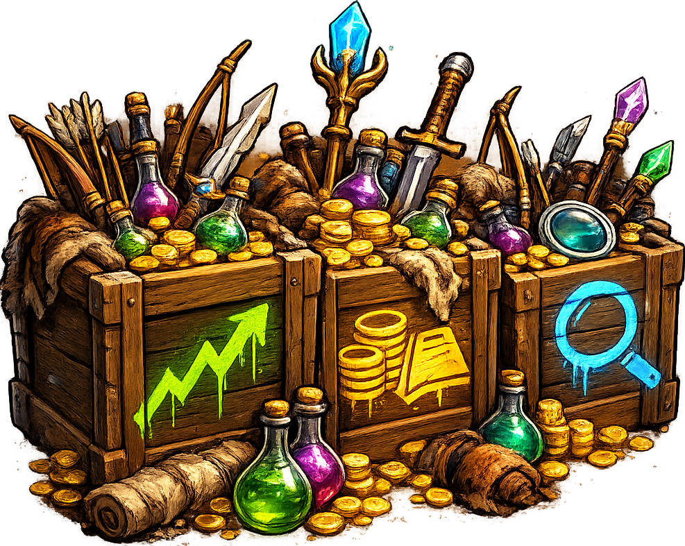

<h1 align="center">Stockpile</h1>

Stockpile is a RuneLite plugin that keeps an eye on the items you care about. Pick the items you want to follow and the plugin counts how many you have, looks up what they are worth right now on the Grand Exchange, and works out how much profit you have actually made. It watches how items really come and go — trading on the Grand Exchange, buying from shops, trading with players, cooking, crafting, and more — so the numbers reflect what actually happened. Charts, market details, on-screen overlays, and price alerts round it out.

## Features

### Live Grand Exchange prices

- **Prices the moment you look**

  Every tracked item shows its current Grand Exchange and wiki prices, refreshed automatically. The plugin also remembers the last prices it saw, so you see real numbers the moment you log in instead of blank dashes.

- **Check any item, no strings attached**

  View-only mode lets you look up any item's prices and charts without adding it to your list.

  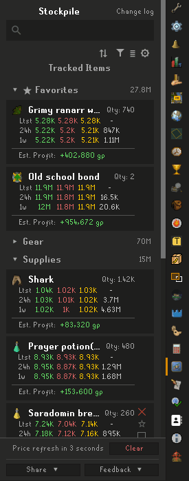 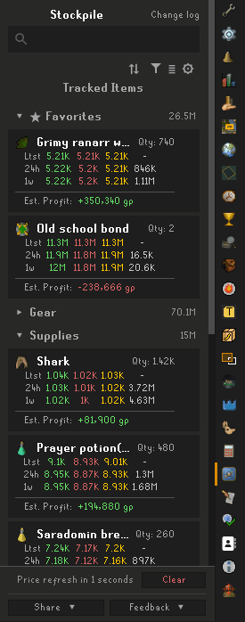

### Track your items and your profit

- **A live list of everything you track**

  Add an item from the search bar or by right-clicking it in the game, and Stockpile starts counting it. Your quantities stay up to date on their own, whether the items sit in your inventory, your bank, or your rune pouch. Each item shows how many you have and what the stack is worth right now.

- **Profit based on what really happened**

  The plugin remembers what you paid for your items and compares it with what they are worth now. It watches how items actually arrive and leave — Grand Exchange trades at the real price your offer went through at, shop buying and selling, trades with other players, picking things up off the ground, gathering from skilling, thieving, boss and minigame rewards, and High/Low Alchemy — and prices each one the right way. Even cooking, crafting, smithing, fletching, herblore, and runecrafting carry an item's cost onto whatever you make from it, and dying doesn't wipe your history.

  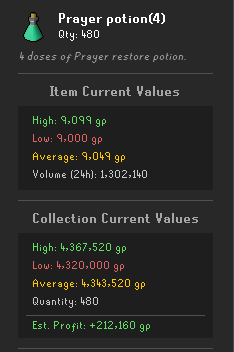

- **See where every item came from**

  Each item has its own collection log showing every batch you gained or lost, where it came from — Grand Exchange, shop, trade, ground, and so on — and what it cost. If something looks off, you can edit the entries yourself to correct or fill in your history.

  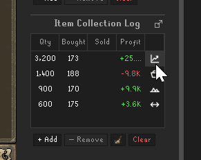

- **Session stats**

  A "Session" line shows how much you have gained or lost since you logged in, split into prices moving on their own versus things you bought and sold.

  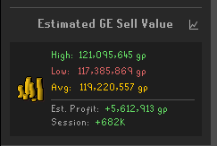

### Charts

- **Price and volume graphs**

  Every item has graphs of its price and how much of it is being traded, from one day back to a full year. Hover to read exact values, or pop a graph out into its own window for a bigger look.

  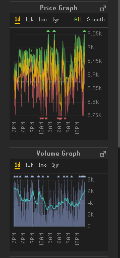 

- **Watch your collection grow**

  A chart of your whole collection's value over time, with a line for how you've done since login. If you remove an item, the chart's history corrects itself too.

  

### Detailed market information

- **Know the market before you trade**

  See an item's Grand Exchange buy limit (and how much of it you have left), the GE tax, and when it was last bought and sold. Old, out-of-date prices are dimmed so you don't get fooled by them.

  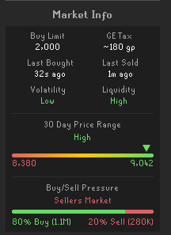

- **How easy is it to buy or sell?**

  Simple ratings show how much an item's price jumps around and how quickly it trades, plus a pressure bar that shows whether people are mostly buying or mostly selling right now. A 30-day bar shows whether today's price is near its recent high or low.

- **Alchemy values**

  High and Low Alchemy values for every item, including whether alching it would make or lose money once the rune cost is counted.

  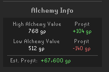

### Organize your list

- **Make the list your own**

  Pin your favourites to the top, group items into your own collapsible categories, or let the plugin sort everything into sensible groups with one click. You can also sort by name, value, profit, or how much the price moved today, or simply drag items into any order you like.

  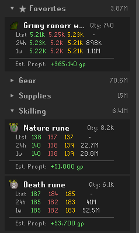 

- **Handle long lists**

  A compact layout fits more items on screen, and a filter box narrows a long list down to what you're looking for in a couple of keystrokes.

  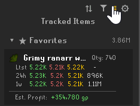 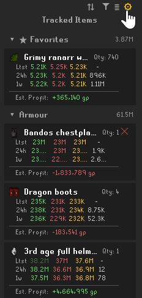

- **Share and back up**

  Export your history to a spreadsheet, or share your tracked list with a friend (or back it up) using a short code.

  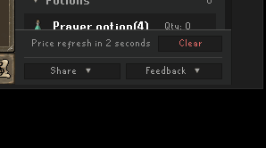

### On-screen overlays and game integration

- **Watch items without opening the panel**

  Show your chosen items in small boxes right on the game screen, so you can keep an eye on prices and profit while you play.

  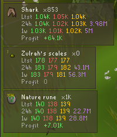

- **Spot your items in the world**

  Tracked items are highlighted on the ground and in your inventory so they stand out.

  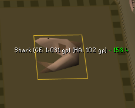

- **Jump in from the Grand Exchange**

  Opening a Grand Exchange offer can open that item in Stockpile automatically, or add a "View in Stockpile" button to the offer screen.

  

### Price alerts

- **Get told when it matters**

  Set alerts per item — for example "tell me when the price goes above 1,000" — on price, percent change, trade volume, or market ratings. Alerts arrive through RuneLite's normal notifications, and they can re-arm so you're told again the next time it happens.

  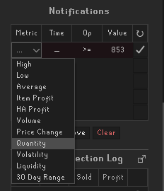 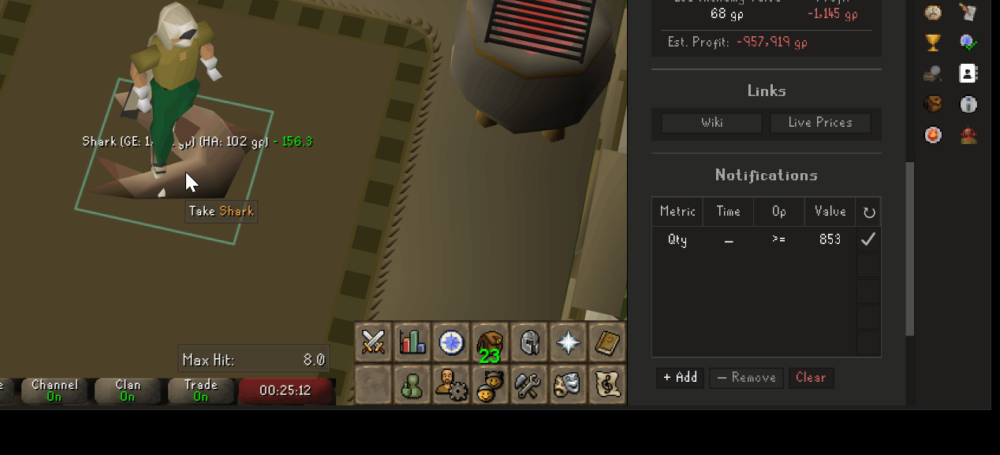

## Links

- [Report a bug](https://github.com/Oveduumnakal/Stockpile-Plugin/issues/new?template=bug_report.yml)
- [Request a feature](https://github.com/Oveduumnakal/Stockpile-Plugin/issues/new?template=feature_request.yml)
- [Buy me a coffee](https://buymeacoffee.com/oveduumnakal)
