

  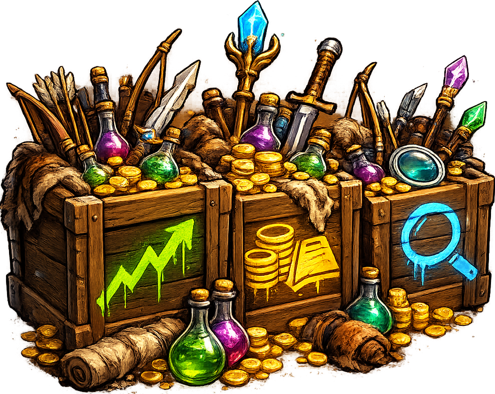

<h1 align="center">Stockpile</h1>

Stockpile is a RuneLite plugin that keeps an eye on the items you care about. Pick the items you want to follow and the plugin counts how many you have, looks up what they are worth right now on the Grand Exchange, and works out how much profit you have actually made. It watches how items really come and go — trading on the Grand Exchange, buying from shops, trading with players, cooking, crafting, and more — so the numbers reflect what actually happened. Charts, market details, side-by-side comparisons, on-screen overlays, and price alerts round it out.

## Features

### Live Grand Exchange prices

- **Prices the moment you look**

  Every tracked item shows its current Grand Exchange and wiki prices, refreshed automatically. The plugin also remembers the last prices it saw, so you see real numbers the moment you log in instead of blank dashes.

- **Check any item, no strings attached**

  View-only mode lets you look up any item's prices and charts without adding it to your list.

  <a href="docs/img/01-tracked-list.gif" title="Click to play the animation">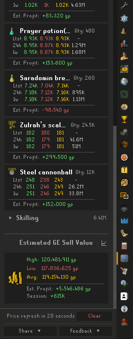</a> <a href="docs/img/02-view-only.gif" title="Click to play the animation">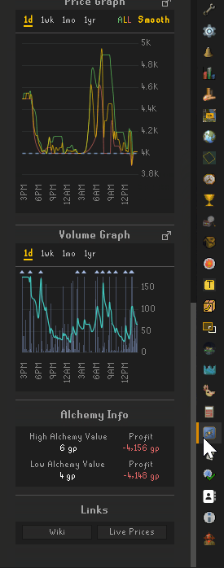</a>

### Track your items and your profit

- **A live list of everything you track**

  Add an item from the search bar or by right-clicking it in the game, and Stockpile starts counting it. Your quantities stay up to date on their own, whether the items sit in your inventory, your bank, or your rune pouch. Each item shows how many you have and what the stack is worth right now.

- **Profit based on what really happened**

  The plugin remembers what you paid for your items and compares it with what they are worth now. It watches how items actually arrive and leave — Grand Exchange trades at the real price your offer went through at, shop buying and selling, trades with other players, picking things up off the ground, gathering from skilling, thieving, boss and minigame rewards, and High/Low Alchemy — and prices each one the right way. Even cooking, crafting, smithing, fletching, herblore, and runecrafting carry an item's cost onto whatever you make from it, and dying doesn't wipe your history.

  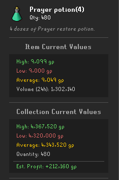

- **See where every item came from**

  Each item has its own collection log showing every batch you gained or lost, where it came from — Grand Exchange, shop, trade, ground, and so on — and what it cost. If something looks off, you can edit the entries yourself to correct or fill in your history.

  <a href="docs/img/05-collection-log.gif" title="Click to play the animation">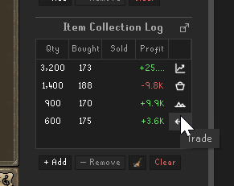</a>

- **Session stats**

  A "Session" line shows how much you have gained or lost since you logged in, split into prices moving on their own versus things you bought and sold.

  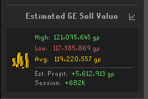

### Charts

- **Price and volume graphs**

  Every item has graphs of its price and how much of it is being traded, from one day back to a full year. Hover to read exact values, or pop a graph out into its own window for a bigger look.

  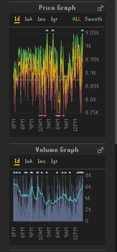 <a href="docs/img/08-chart-popout.gif" title="Click to play the animation">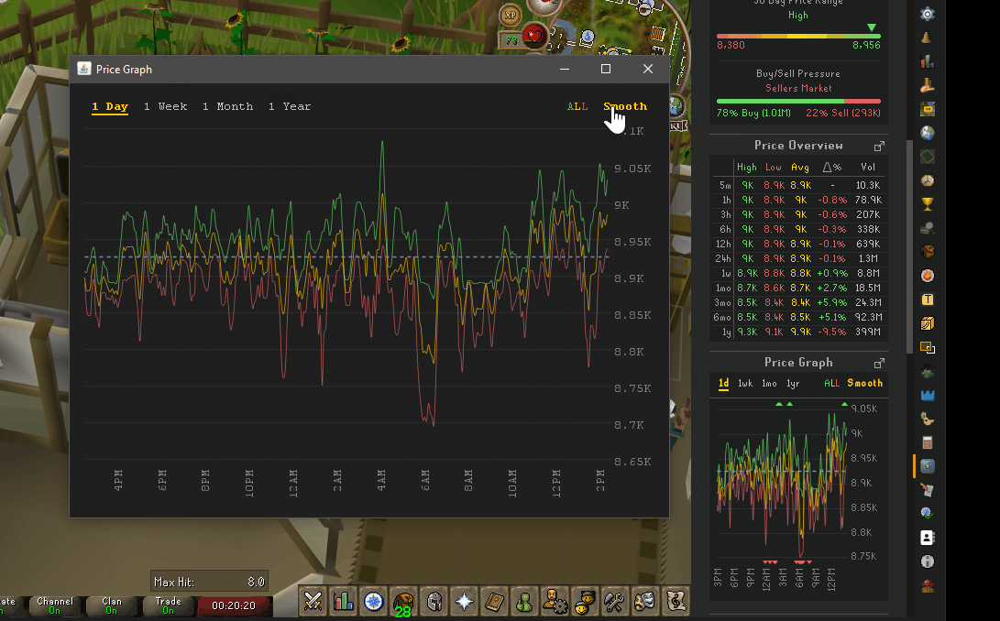</a>

- **Watch your collection grow**

  A chart of your whole collection's value over time, with a line for how you've done since login. If you remove an item, the chart's history corrects itself too.

  <a href="docs/img/09-portfolio-history.gif" title="Click to play the animation">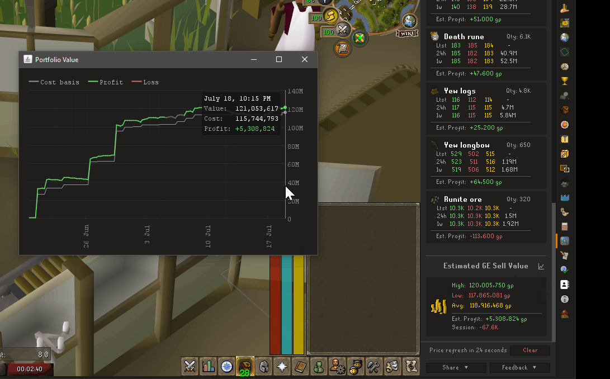</a>

### Dashboard

- **Pop an item out into its own window**

  Open any item's detail view as a standalone, resizable window that lives outside the side panel. It lays everything out across columns — current values, market info, alchemy, collection log, and the price and volume charts side by side — so you get the full picture at a glance, and it keeps updating live while you play. Open as many as you like to watch several items at once.

  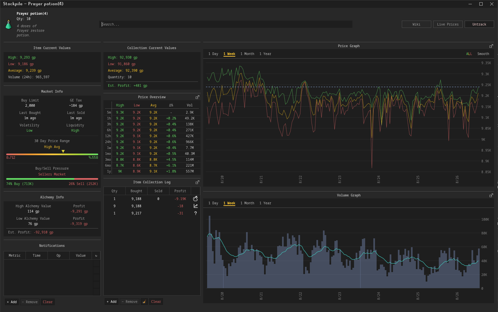

- **A home base for looking things up**

  Open the dashboard on its own from the panel's toolbar and search for any item to pull up its full detail — no need to track it first. Pick a different item and the window switches to it in place.

  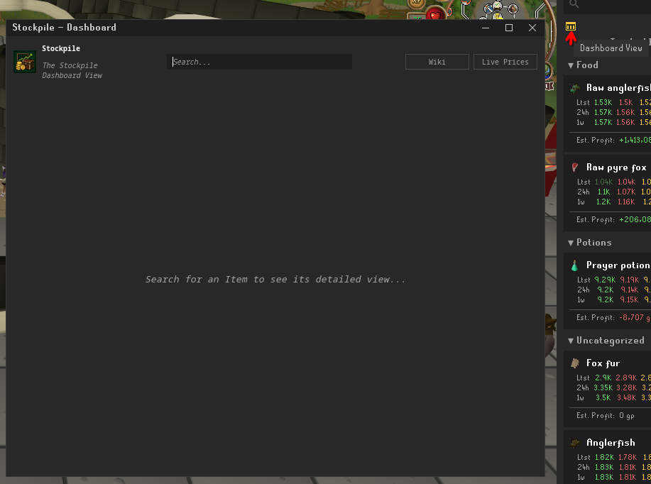

### Detailed market information

- **Know the market before you trade**

  See an item's Grand Exchange buy limit (and how much of it you have left), the GE tax, and when it was last bought and sold. Old, out-of-date prices are dimmed so you don't get fooled by them.

  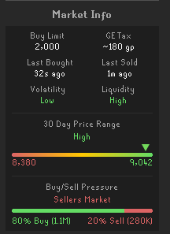

- **How easy is it to buy or sell?**

  Simple ratings show how much an item's price jumps around and how quickly it trades, plus a pressure bar that shows whether people are mostly buying or mostly selling right now. A 30-day bar shows whether today's price is near its recent high or low.

- **Alchemy values**

  High and Low Alchemy values for every item, including whether alching it would make or lose money once the rune cost is counted.

  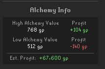

### Compare items

- **Line items up side by side**

  Put up to six items next to each other in their own window and read them off in one go — prices, buy limit and GE tax, market ratings, alchemy, what you are holding and what you have made on it, and a trend line with trading volume underneath. Items you don't track can go in too, so you can weigh something up before committing to it. Open it from the panel's toolbar, an item's detail view, or a tracked item's right-click menu. Drag the columns into whatever order suits you, and drop one with the X on its header.

  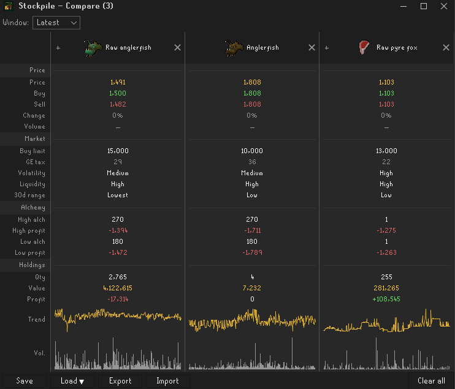

- **Pick the time frame**

  A Window dropdown switches every column at once between the latest prices and 5-minute, hourly, 6-hour, daily, weekly, or monthly figures, so the numbers and charts all cover the same stretch of time.

  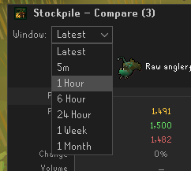

- **Compare every variant at once**

  One click fills the window with an item's whole family — all four doses of a potion, or the raw, cooked, and burnt forms of a food. Use **Compare all variants** from a tracked item's right-click menu, or the + on any column header once the window is open.

- **Save, reload, and share a comparison**

  Save a comparison under a name and bring it back whenever you want from the Load menu. Export one to a short code to send to a friend, or paste a friend's code in to load theirs. Your saved comparisons stay put between sessions.

### Organize your list

- **Make the list your own**

  Pin your favourites to the top, group items into your own collapsible categories, or let the plugin sort everything into sensible groups with one click. You can also sort by name, value, profit, or how much the price moved today, or simply drag items into any order you like.

  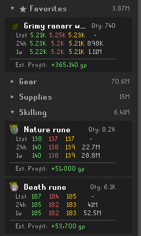 <a href="docs/img/14-auto-categorize.gif" title="Click to play the animation">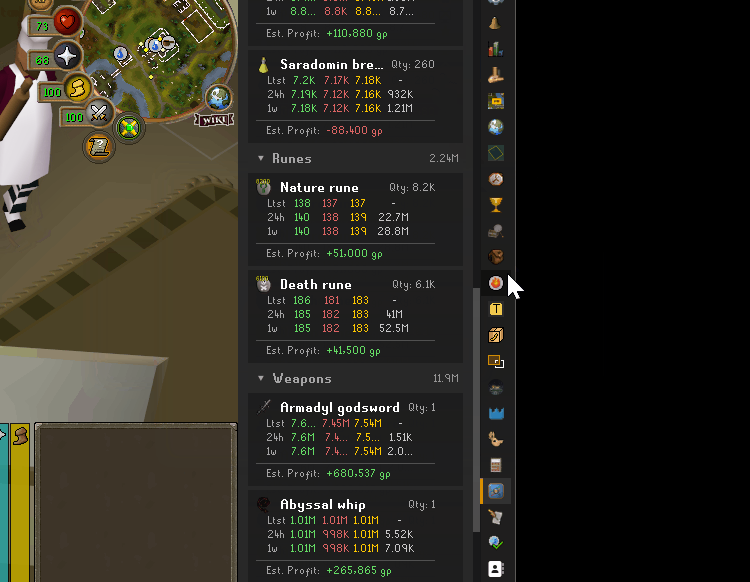</a>

- **Actions where you want them**

  Every tracked row carries the same actions — view its detail, open it in the dashboard, add it to a comparison, favourite it, compact it, put it on the overlay, or stop tracking it. Choose how they reach you: a right-click menu, buttons that appear when you hover over the row, or both. The right-click menu is the default; switch to hover buttons in the settings if you prefer them.

  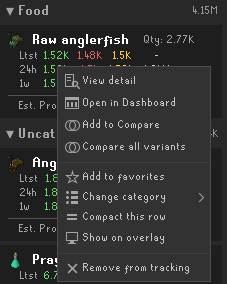

- **Move an item to another category**

  Right-click a tracked item and pick **Change category** to move it into any category you already have, back to Uncategorized, or into a brand-new one you name on the spot.

  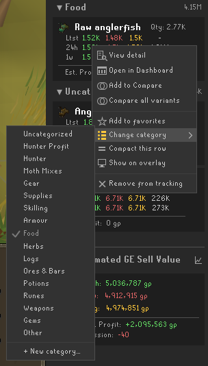

- **Handle long lists**

  A compact layout fits more items on screen, and a filter box narrows a long list down to what you're looking for in a couple of keystrokes.

  <a href="docs/img/15-compact-vs-standard.gif" title="Click to play the animation">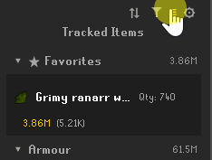</a> <a href="docs/img/16-filter-box.gif" title="Click to play the animation">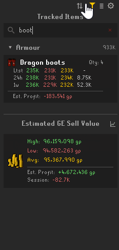</a>

- **Share and back up**

  Export your history to a spreadsheet, or share your tracked list with a friend (or back it up) using a short code.

  <a href="docs/img/17-share-export.gif" title="Click to play the animation">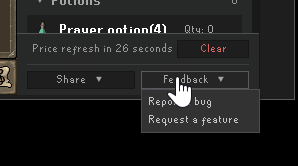</a>

### On-screen overlays and game integration

- **Watch items without opening the panel**

  Show your chosen items in small boxes right on the game screen, so you can keep an eye on prices and profit while you play.

  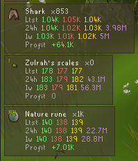

- **Spot your items in the world**

  Tracked items are highlighted on the ground and in your inventory so they stand out.

  <a href="docs/img/19-item-highlights.gif" title="Click to play the animation">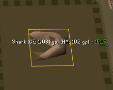</a>

- **Jump in from the Grand Exchange**

  Opening a Grand Exchange offer can open that item in Stockpile automatically, or add a "View in Stockpile" button to the offer screen.

  <a href="docs/img/20-ge-integration.gif" title="Click to play the animation">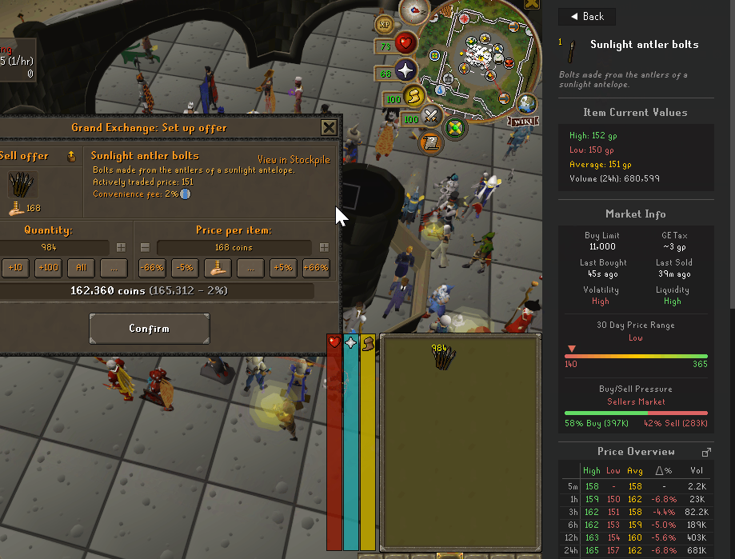</a>

- **Right-click straight into Stockpile**

  Shift + right-click an item anywhere in the game for a "Stockpile" menu that lets you track or untrack it, view it in the panel, or open it straight in the dashboard — without hunting for it first. Which entries appear, and the key used, are up to you in the settings.

  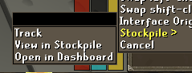

### Price alerts

- **Get told when it matters**

  Set alerts per item — for example "tell me when the price goes above 1,000" — on price, percent change, trade volume, or market ratings. Alerts arrive through RuneLite's normal notifications, and they can re-arm so you're told again the next time it happens.

  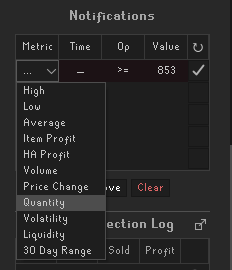 <a href="docs/img/22-alert-firing.gif" title="Click to play the animation">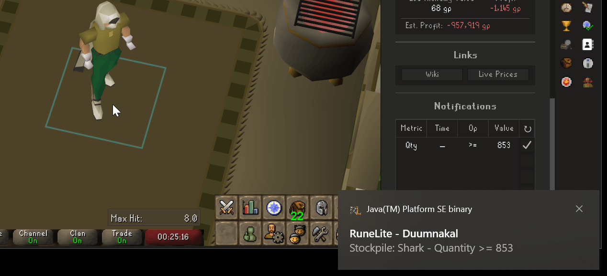</a>

## Links

- [Report a bug](https://github.com/Oveduumnakal/Stockpile-Plugin/issues/new?template=bug_report.yml)
- [Request a feature](https://github.com/Oveduumnakal/Stockpile-Plugin/issues/new?template=feature_request.yml)
- [Buy me a coffee](https://buymeacoffee.com/oveduumnakal)
